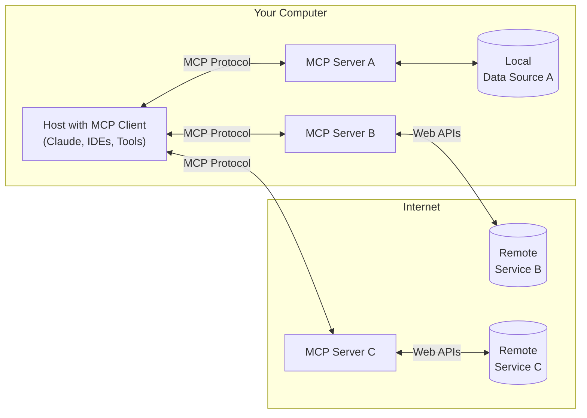

## Model Context Protocol(MCP)  とは
Model Context Protocol（MCP）とは、Anthropic社が公開しているオープンソースのプロトコルで、

アプリケーションがLLMに対して何かしらのコンテキストを提供する際のプロトコルを標準化したものになります。

各AIエージェントを取り扱うMCP Client は、設定されたMCP Server の設定をもとに、Remote のデータソースであったり、何かしらのツールを利用可能になります。



ref:  [https://modelcontextprotocol.io/introduction:title]

## MCP-UI とは

[https://mcpui.dev/:embed:cite]

MCP を拡張して、AIエージェントが「インタラクティブなUI」をリソースとして返却することを可能にするプロトコルです。

これを用いることで、チャットUIから自然言語でAIに問い合わせると、AIエージェントがMCPの設定を読んで、 **ユーザが求めるUIを選択して返却することが可能になります** 。

公式のTOPにあるデモ動画が提供されているため、こちらが参考になります。

<div class="video-container" style="display: flex; justify-content: center; align-items: center;">
  <video controls width="100%" style="max-width: 800px; border-radius: 8px; box-shadow: 0 4px 12px rgba(0, 0, 0, 0.15);">
    <source src="https://github.com/user-attachments/assets/7180c822-2dd9-4f38-9d3e-b67679509483" type="video/mp4">
    Your browser does not support the video tag.
  </video>
</div>

現在、MCP-UI では TypeScript、Ruby、Python の3種のSDK が提供されています。


[https://github.com/idosal/mcp-ui/tree/main/sdks:title]


今回は、このMCP-UIの **TypeScript SDK** を用いて、実際にAIエージェントが返却可能なUIリソースを作成します。

## 完成物
先に、今回の実験の完成物はこちらです。

[https://github.com/daitasu/mcp-ui-playground:embed:cite]

この内容を解説していきます。

MCP-UI の TypeScript SDK は、client サイド、server サイドそれぞれのパッケージを提供しています。

- [@mcp-ui/server](https://www.npmjs.com/package/@mcp-ui/server)
- [@mcp-ui/client](https://www.npmjs.com/package/@mcp-ui/client)

## MCP サーバを実装する
まずは、MCPサーバ側から作成します。

ひとまず、Express でmcp 用のAPIを立てます。
MCP の実装には Streamable Http を用いますが、型定義は `mcp-ui/server` が提供しているのでこちらを利用します。

`import { StreamableHTTPServerTransport } from '@modelcontextprotocol/sdk/server/streamableHttp.js';`


```typescript
const transports: { [sessionId: string]: StreamableHTTPServerTransport } = {};

app.post("/mcp", async (req, res) => {
	const sessionId = req.headers["mcp-session-id"] as string | undefined;
	let transport: StreamableHTTPServerTransport;

	if (sessionId && transports[sessionId]) {
		// A session already exists; reuse the existing transport.
		transport = transports[sessionId];
	} else if (!sessionId && isInitializeRequest(req.body)) {
		// This is a new initialization request. Create a new transport.
		transport = new StreamableHTTPServerTransport({
			sessionIdGenerator: () => randomUUID(),
			onsessioninitialized: (sid) => {
				transports[sid] = transport;
				console.log(`MCP Session initialized: ${sid}`);
			},
		});

		// Clean up the transport from our map when the session closes.
		transport.onclose = () => {
			if (transport.sessionId) {
				console.log(`MCP Session closed: ${transport.sessionId}`);
				delete transports[transport.sessionId];
			}
		};

		// Create a new server instance for this specific session.
		const server = new McpServer({
			name: "typescript-server-walkthrough",
			version: "1.0.0",
		});

    // TODO: **ここにUIリソースを返却するMCP ツールの登録を行っていく**

		// Connect the server instance to the transport for this session.
		await server.connect(transport);
	} else {
		return res.status(400).json({
			error: { message: "Bad Request: No valid session ID provided" },
		});
	}

	// Handle the client's request using the session's transport.
	await transport.handleRequest(req, res, req.body);
});

// A separate, reusable handler for GET and DELETE requests.
const handleSessionRequest = async (
	req: express.Request,
	res: express.Response
) => {
	const sessionId = req.headers["mcp-session-id"] as string | undefined;
	if (!sessionId || !transports[sessionId]) {
		return res.status(404).send("Session not found");
	}

	const transport = transports[sessionId];
	await transport.handleRequest(req, res);
};

// GET handles the long-lived stream for server-to-client messages.
app.get("/mcp", handleSessionRequest);

// DELETE handles explicit session termination from the client.
app.delete("/mcp", handleSessionRequest);

app.listen(port, () => {
	console.log(`Server listening at http://localhost:${port}`);
	console.log(`MCP endpoint available at http://localhost:${port}/mcp`);
});
```

次に、中身を実装していきます。

## 1. シンプルな `rawHtml` の返却
まずはシンプルな rawHtml を返却してみます。

```typescript
// Register our MCP-UI tool on the new server instance.
server.registerTool(
	"get_hello_world",
	{
		title: "HelloWorld",
		description: "シンプルなHTMLのリソースを返すツールです",
		inputSchema: {},
	},
	async () => {
		const uiResource = createUIResource({
			uri: "ui://hello_world",
			content: { type: "rawHtml", htmlString: "<p>hello_world</p>" },
			encoding: "text",
		})
		return {
			content: [uiResource],
		};
	}
);
```

`registerTool()` は、第一引数で MCP Tool の名前、第二引数で メタ情報、第三引数でコールバック関数として、返却するUIリソースを設定します。

`createUIResource` の詳細は下記の通りです。

- `uri` ... ui スキーマを指定して、クライアント側でMCP-UI を識別するための一意のurl を設定する
- `content` ... type は 3つある。
   - `rawHtml` ... そのまま `htmlString` で直接DOMを書き、その内容を返却する
   - `externalUrl` ... 外部URL を指定して、その内容を描画する
   - `remoteDom` ... `mcp-ui/client` が提供するコンポーネントや、自前で設定したコンポーネントを利用する場合はこちらを扱う
- `encoding`  `text` もしくは  `blob` を指定する

次に、クライアントサイドです。

```typescript
const fetchMcpResource = async (
  toolName: string
): Promise<ContentBlock | undefined> => {
  const client = new Client({
    name: "streamable-http-client",
    version: "1.0.0",
  });

  const transport = new StreamableHTTPClientTransport(
    new URL("http://localhost:4040/mcp")
  );
  await client.connect(transport);
  let result: any;

  // server で実装した ツールを呼び出す
  if (toolName === "get_hello_world") {
    result = await client.callTool({
      name: toolName,
      arguments: {},
    });
  } else {
    throw new Error(`Unknown tool: ${toolName}`);
  }

  return (result?.content as ContentBlock[])[0];
};

loadResource = async (toolName: string) => {
    setLoading(true);
    setError(null);
    setUIResource(null);
    try {
      const block = await fetchMcpResource(toolName);
      setUIResource(block?.resource as Resource);
    } catch (e: any) {
      setError(e.message);
    }
    setLoading(false);
  };

  return (
    <div>
      <div>
        <div>
          <div>
            {loading && <p>Loading resource...</p>}
            {error && <p>Error: {error}</p>}
          </div>

          {uiResource && (
            <div>
              <h2>
                Rendering Resource: {uiResource.uri}
              </h2>
              <div>
                <UIResourceRenderer
                  resource={uiResource}
                  htmlProps={{
                    style: {
                      width: "1200px",
                      height: "400px",
                      padding: "16px",
                    },
                  }}
                />
              </div>
            </div>
          )}
        </div>
      </div>
    </div>
  );
};

export default App;
```

今回は実験のため、Mastra の設定などAIエージェントは使わず、直接MCPサーバを呼び出してみます。

```typescript
  const transport = new StreamableHTTPClientTransport(
    new URL("http://localhost:4040/mcp")
  );
  await client.connect(transport);
  let result: any;

  // server で実装した ツールを呼び出す
  if (toolName === "get_hello_world") {
    result = await client.callTool({
      name: toolName,
      arguments: {},
    });
```

この部分でMCPサーバとの接続を行い、server 側で実装したツールを呼び出しています。

```typescript
<UIResourceRenderer
  resource={uiResource}
/>
```

`UIResourceRenderer` は、`@mcp-ui/client` が提供するコンポーネントです。
MCP サーバーからの応答を受け取り、resouce のタイプごとに出し分けを行い、 `iframe 上に立ち上げた sandbox 環境` でレンダリングされます。

[f:id:daitasu:20251109122241p:plain]

## 2. 外部リンクをUIリソースとして返却する
外部リソースを返却する場合は、 server サイドのcontent.type として `externalUrl` を利用します。

```typescript
server.registerTool(
	"get_external_link",
	{
		title: "GetExternalLink",
		description: "外部リソースのリンクを返します",
		inputSchema: {},
	},
	async () => {
		// Create the UI resource to be returned to the client (this is the only part specific to MCP-UI)
		const uiResource = createUIResource({
			uri: "ui://external_link",
			content: { type: "externalUrl", iframeUrl: "https://example.com" },
			encoding: "text",
		})
		return {
			content: [uiResource],
		};
	}
);
```

この例だと、 `https://example.com` の内容を iframe 上にレンダリングすることになります。

クライアントサイドでは特に変更はなく、 `UIResourceRenderer` がresouce タイプを読み取って、指定された tool 名が `get_external_link`の場合は 外部リンクが描画されることになります。

[f:id:daitasu:20251109122836p:plain]

## 3. `mcp-ui/client` が提供するコンポーネントを用いて、インタラクティブなアクションを行う
次に、 `mcp-ui/client` が提供しているコンポーネントをUIリソースとして返却できるようにし、iframe 上のUIでインタラクティブなアクションを行ってみます。

サーバサイドで新しく tool を登録します。

```typescript
server.registerTool(
	"get_action_button",
	{
		title: "GetActionButton",
		description: "インタラクティブなアクションボタンのUIリソースを返します",
		inputSchema: {
			label: z.string(),
		},
	},
	async ({ label }) => {
		const uiResource = createUIResource({
			uri: "ui://action_button",
			content: {
				type: "remoteDom",
				framework: "react",
				script: `
			  const button = document.createElement('ui-button');
			  button.setAttribute('label', '${label}');
			  button.addEventListener('press', () => {
			    window.parent.postMessage({
						type: 'notify',
						payload: {
							message: 'アクションが実行されました！ at' +${Date.now()}
						}
					}, '*');
			  });
			  root.appendChild(button);
        `,
			},
			encoding: "text",
		})
		return {
			content: [uiResource],
		};
	}
);
```

MCP-UIの UI リソースにイベントを渡すには `addEventListener` を指定し、 `window.parent.postMessage` を使う必要があります。
これによってiframe 内で発火したイベントがクライアント側で取得できるようになります。

種類は色々とあり、代表的な5つを紹介します。

- `intent` ... ユーザーがUIを操作して意図を表明する際に用いる
- `notify` ... 既にユーザーの操作で意図した動作が発火しており、メッセージのみを通知する
- `prompt` ... iframe がクライアントに対して、指定したプロンプトを要求する
- `tool` ... iframe が次のツール呼び出しを要求する。UI リソースから直接次のUIリソースにつなげる
- `link` ... igrame がクライアントに対してリンクへの移動を要求する

実際のチャットプロダクトでは、これらのインタラクティブなアクションをMCPクライアントが受取り、**AIエージェントがその要求に沿って次のアクションを起こすことになります**。

他にも色々なメッセージの種類があります。


[https://mcpui.dev/guide/embeddable-ui:embed:cite]


